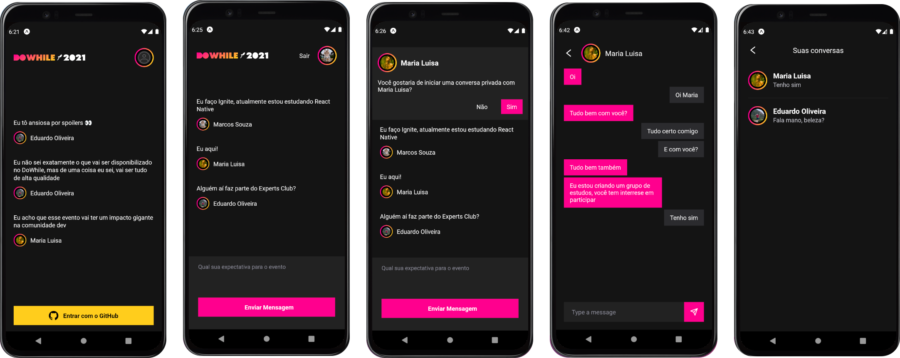

<h1 align="center">NLW Heat Mobile</h1>



## About
This project was built during the Next Level Week event, its main goal is to gather people to talk about their expectations for a future event, called DoWhile. After watching all classes, I decided to implement a private chat.

## Technologies
- [React Native](https://reactnative.dev/)
- [Expo](https://docs.expo.dev/)
- [Socket.io](https://socket.io/) (web socket client)
- [Moti](https://moti.fyi/) (animations)

## Dependencies
Since this project connects with Github, you'll need to create a oAuth app on your GitHub. You can follow this [tutorial](https://docs.github.com/en/developers/apps/building-oauth-apps/creating-an-oauth-app) to create the oAuth app. After creating the oAuth app, you need to add the environment variables on the ```.env``` file.

### .env example
```
  # GitHub
  GITHUB_CLIENT_ID=YOUR_GITHUB_CLIENT_ID
```

Note: The project will only work correctly if the back-end project is running already, you can find the repository [here](https://github.com/Eduardo-H/nlw-heat-node).

## Usage
To follow this app you can follow these steps:<br>
- Clone the repository with ```git clone https://github.com/Eduardo-H/nlw-heat-mobile```
- Navigate into the project's folder ```cd nlw-heat-mobile/```
- Install all the project's dependencies by running ```yarn```
- Run the app with ```expo start```